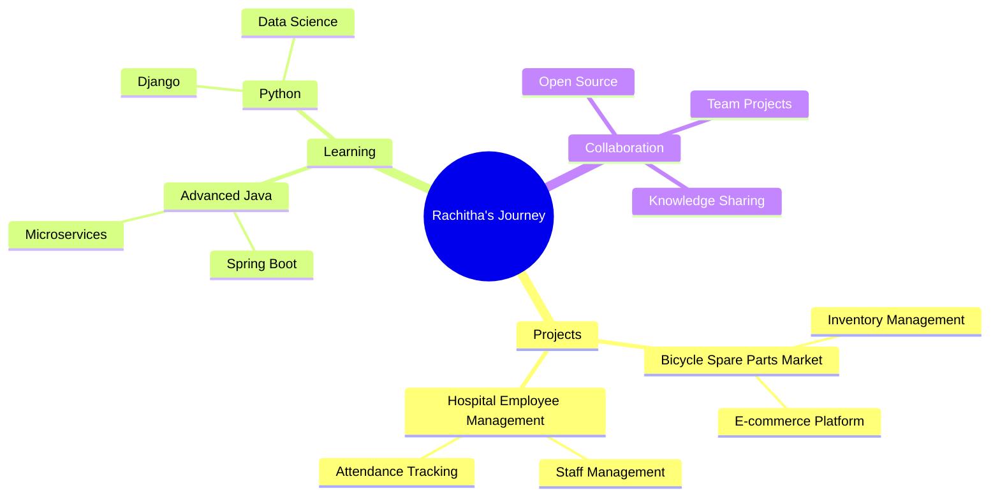

<div align="center">


<div align="center">
  <a href="https://linkedin.com/in/rachithaeshan">
    
  </a>
  <a href="https://instagram.com/rachithaeshan">
    
  </a>
  <a href="mailto:rachitaeshan@gmail.com">
    
  </a>
  <a href="https://fb.com/rachithaeshan">
    
  </a>
</div>

<br>


</div>

<!-- Profile Views Counter -->
<p align="center">
  
  
  
</p>

---


<h2 align="center">
  
  About Me
</h2>


```typescript
interface Developer {
  name: string;
  location: string;
  education: string;
  role: string;
  languages: string[];
  technologies: {
    frontend: string[];
    backend: string[];
    database: string[];
    tools: string[];
  };
  currentFocus: string[];
  funFact: string;
}

const rachitha: Developer = {
  name: "Rachitha Eshan",
  location: "Sri Lanka 🇱🇰",
  education: "BSc IT @ SLIIT",
  role: "Undergraduate Developer",
  languages: ["Java", "Python", "JavaScript", "C/C++", "Kotlin"],
  technologies: {
    frontend: ["React", "HTML5", "CSS3", "Tailwind CSS"],
    backend: ["Node.js", "Express"],
    database: ["MongoDB", "MySQL"],
    tools: ["Git", "Postman", "Figma", "Android Studio"]
  },
  currentFocus: [
    "🔭 Working on Bicycle Spare Parts Market",
    "🌱 Learning Advanced Java & Python",
    "👯 Open to collaborate on Hospital Management System",
    "🎯 Building scalable web applications"
  ],
  funFact: "I debug with console.log 😄"
};
```

<br clear="both">


<h2 align="center">
  
  Tech Stack Arsenal
</h2>

<div align="center">

<table>
<tr>
<td valign="top" width="33%">

#### 🎨 Frontend


</td>

<td valign="top" width="33%">

#### ⚙️ Backend & Languages


</td>

<td valign="top" width="33%">

#### 🗄️ Database & Tools


</td>
</tr>
</table>

</div>


<h2 align="center">
  
  GitHub Statistics
</h2>

<div align="center">
   
  
</div>

<div align="center">
  
  
</div>

<br>

<p align="center">
  
</p>


<h2 align="center">
  
  GitHub Trophies
</h2>

<p align="center">
  
</p>

<p align="center">
  
</p>


<h2 align="center">
  📊 Contribution Stats
</h2>

<div align="center">


</div>


<h2 align="center">
  💭 Developer Quote of the Day
</h2>

<div align="center">


</div>


<h2 align="center">
  🎮 Watch the Snake Eat My Contributions!
</h2>

<div align="center">
  
</div>


<h2 align="center">
  🎯 Current Goals & Projects
</h2>

<div align="center">



</div>


<h2 align="center">
  📈 Metrics & Analytics
</h2>

<div align="center">

![Metrics](https://metrics.lecoq.io/rachithaeshan?template=classic&base.header=0&base.activity=0&base.community=0&base.repositories=0&base.metadata=0&languages=1&lines=1&habits=1&followup=1&isocalendar=1&achievements=1&base=header%2C%20activity%2C%20community%2C%20repositories%2C%20metadata&base.indepth=false&base.hireable=false&base.skip=false&isocalendar=false&isocalendar.duration=half-year&languages=false&languages.limit=8&languages.threshold=0%25&languages.other=false&languages.colors=github&languages.sections=most-used&languages.indepth=false&languages.analysis.timeout=15&languages.analysis.timeout.repositories=7.5&languages.categories=markup%2C%20programming&languages.recent.categories=markup%2C%20programming&languages.recent.load=300&languages.recent.days=14&habits=false&habits.from=200&habits.days=14&habits.facts=true&habits.charts=false&habits.charts.type=classic&habits.trim=false&habits.languages.limit=8&habits.languages.threshold=0%25&followup=false&followup.sections=repositories&followup.indepth=false&followup.archived=true&achievements=false&achievements.threshold=C&achievements.secrets=true&achievements.display=detailed&achievements.limit=0&config.timezone=Asia%2FColombo)

</div>


<h2 align="center">
  🌟 Support & Connect
</h2>

<div align="center">

[](https://linkedin.com/in/rachithaeshan)
[](https://instagram.com/rachithaeshan)
[](https://fb.com/rachithaeshan)
[](mailto:rachitaeshan@gmail.com)

<br>

### 💖 Show some love by starring ⭐ my repositories!


</div>

---

<div align="center">

### 📊 Detailed Stats


</div>

---


<div align="center">

### 🎉 Thanks for visiting my profile! 


</div>
